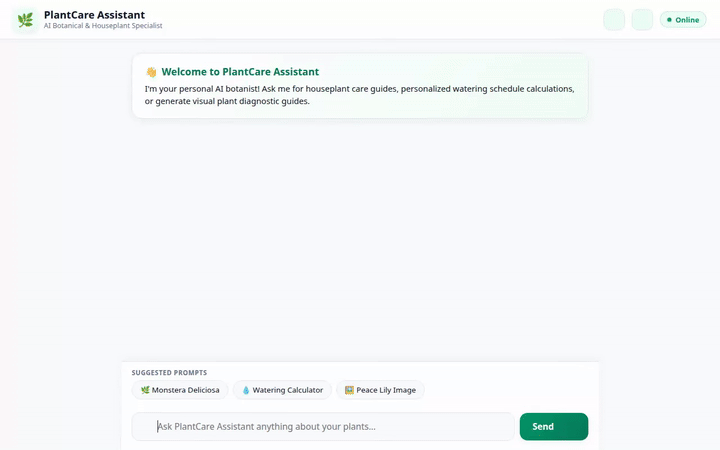

# 🌿 PlantCare Assistant

An intelligent AI botanical and houseplant specialist built with the Google Agent Development Kit (ADK), Gemini, Firestore, Vertex AI Memory Bank, and Cloud Storage.



---

## 🌟 Key Features & Capabilities

* **🌿 Firestore Plant Catalog Lookup**: Queries live plant records from a Google Cloud Firestore database (`house_plants` collection) by plant name, scientific details, care level, and toxicity attributes.
* **💧 Smart Watering Calculator**: Calculates precise watering requirements (volume in mL / fl oz and frequency in days) based on pot size, room temperature, and humidity levels.
* **🎨 Visual Plant Diagnostic Image Generation**: Generates high-quality visual plant care reference images using Google Imagen 3 (`imagen-3.0-generate-002`).
* **📹 Omni Time-Lapse Video Generation**: Generates botanical time-lapse videos using Google's Omni model (`gemini-omni-flash-preview`) via the Vertex AI Interactions API, storing artifacts in session memory and uploading directly to Google Cloud Storage.
* **📷 Plant Diagnostic Photo Upload**: Attach real plant photos directly in the chat bar for AI visual health diagnosis and pest detection.
* **📅 iCalendar (.ics) Watering Export**: Generates exportable `.ics` calendar files for recurring watering reminders in Google Calendar and Apple Calendar.
* **🎤 Voice Input (Speech Recognition)**: Integrated hands-free microphone input using Web Speech API for real-time voice queries.
* **🌤️ Microclimate & Live Weather Care Advice**: Fetches live temperature and humidity to generate real-time weather-adjusted plant care tips.
* **🛒 Local Nursery & Plant Store Finder**: Locates nearby garden centers and florists with Google Maps directions links.
* **🧠 Vertex AI Memory Bank**: Retains user plant care preferences, indoor environment parameters, and plant collections across multi-session conversations.
* **💻 Code Execution Sandbox**: Runs Python analytical code safely using the Vertex AI Agent Engine Sandbox (`AgentEngineSandboxCodeExecutor`).
* **📊 A2UI Dynamic UI Cards**: Emits native A2UI interface components (Cards, Columns, Rows, Images, Icons) rendered directly inside the chat window.
* **✨ Modern Botanical Web Interface**: Includes custom dark/light theme switching, full-screen image lightbox modal, animated wave thinking indicators, chat history modal (`📜`), and quick-prompt suggestion chips.

---

## 🏗️ Architecture & Cloud Infrastructure

* **Agent Engine / Runtime**: Google ADK Agent Engine deployed on Vertex AI (`us-east1`).
* **Database**: Google Cloud Firestore database in Native mode.
* **Object Storage**: Google Cloud Storage public bucket for plant assets.
* **Memory Service**: Vertex AI Memory Bank Service.
* **Frontend**: FastAPI async server proxying Agent-to-Agent (A2A) protocol streams to the agent runtime.

---

## 📂 Project Structure

```
.
├── app/
│   ├── agent.py            # Primary ADK agent definition & tools
│   ├── a2ui_utils.py       # A2UI callback transformer for card rendering
│   └── __init__.py
├── frontend/
│   ├── main.py             # FastAPI proxy server (A2A protocol engine)
│   └── static/
│       └── index.html      # Responsive botanical chat interface
├── agents-cli-manifest.yaml # Agent deployment specification
├── demo.gif                # Inline preview recording of the application
└── README.md
```

---

## 🚀 Local Setup & Running Instructions

### Prerequisites

* Python 3.11+
* Google Cloud SDK (`gcloud`) authenticated to a GCP project with Vertex AI, Firestore, and Cloud Storage enabled.

### 1. Installation

Clone the repository and install the dependencies:

```bash
# Create and activate virtual environment
python -m venv .venv
source .venv/bin/activate

# Install required packages
pip install google-adk google-genai google-cloud-firestore google-cloud-storage fastapi uvicorn
```

### 2. Configure Environment Variables

Set your GCP Project ID and Agent Engine Resource Name:

```bash
export GOOGLE_CLOUD_PROJECT="<your-gcp-project-id>"
export AGENT_ENGINE_RESOURCE_NAME="projects/<project-number>/locations/us-east1/reasoningEngines/<engine-id>"
export AGENT_DIRECTORY="app"
```

### 3. Start the Application

Launch the local development server:

```bash
cd frontend
python main.py
```

Once started, the server listens locally on port `8080`.
